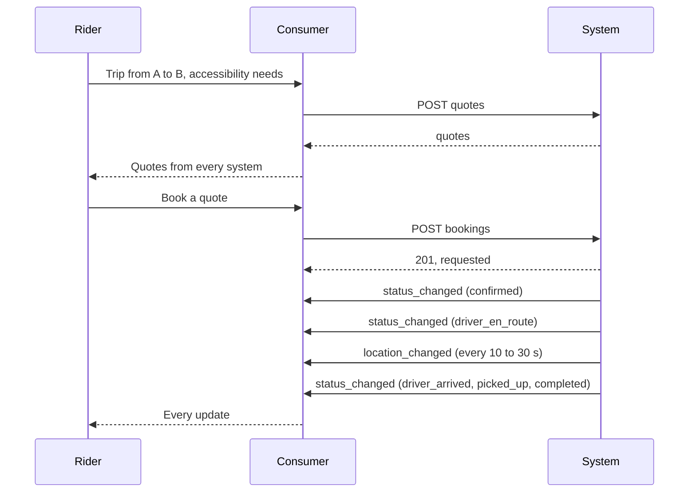
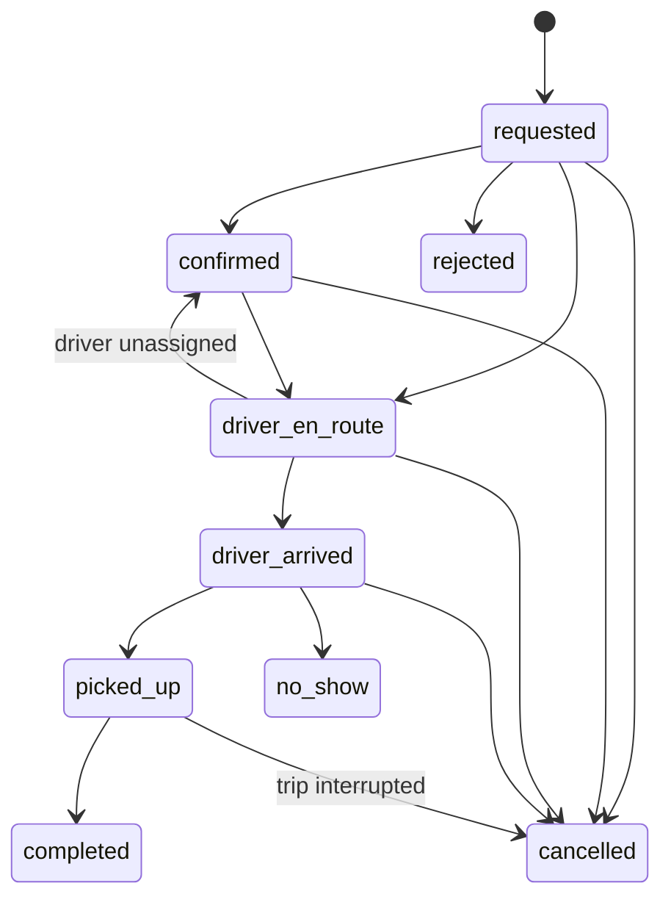

## General On-Demand Feed Specification Reference

This document defines the format and structure of the files that comprise a GOFS dataset.

## Table of Contents

1. [Document Conventions](#document-conventions)
   - [Term Definitions](#term-definitions)
   - [Presence](#presence)
   - [Field Types](#field-types)
2. [Dataset Files](#dataset-files)
3. [File Requirements](#file-requirements)
   - [Auto-discovery](#auto-discovery)
   - [Versioning](#versioning)
   - [Localization](#localization)
   - [Output Format](#output-format)
4. [Field Definitions](#field-definitions)
   - [gofs.json](#gofsjson)
   - [gofs_versions.json](#gofs_versionsjson)
   - [system_information.json](#system_informationjson)
   - [service_brands.json](#service_brandsjson)
   - [vehicle_types.json](#vehicle_typesjson)
   - [zones.json](#zonesjson)
   - [operating_rules.json](#operating_rulesjson)
   - [calendars.json](#calendarsjson)
   - [fares.json](#faresjson)
   - [wait_time](#wait_time)
   - [booking_rules.json](#booking_rulesjson)
   - [realtime_booking](#realtime_booking)
   - [booking_information.json](#booking_informationjson)
   - [quotes](#quotes)
   - [bookings](#bookings)
5. [Booking](#booking)
   - [Booking Statuses](#booking-statuses)
   - [Booking Events](#booking-events)
   - [Idempotency](#idempotency)
   - [Errors](#errors)


## Document Conventions

The key words "MUST", "MUST NOT", "REQUIRED", "SHALL", "SHALL NOT", "SHOULD", "SHOULD NOT", "RECOMMENDED", "MAY", and "OPTIONAL" in this document are to be interpreted as described in [RFC 2119](https://tools.ietf.org/html/rfc2119).

### Term Definitions

* JSON - [JavaScript Object Notation](https://www.w3schools.com/js/js_json_datatypes.asp) is a lightweight format for storing and transporting data. This document uses many terms defined by the JSON standard, including field, array, and object.
* GeoJSON - [GeoJSON](https://geojson.org/) is a format for encoding a variety of geographic data structures.

### Presence

Presence conditions applicable to fields and files:

* REQUIRED - The file or the field MUST be included in the dataset, and a value MUST be provided in the field for each record.
* OPTIONAL - The file or the field MAY be omitted from the dataset, and a value MAY be omitted in the field for any record.
* Conditionally REQUIRED - The file or the field is REQUIRED under certain conditions, which are outlined in the file or field description. Outside of these conditions, the file or the field is OPTIONAL.

### Field Types

- **Array** - A JSON element consisting of an ordered sequence of zero or more values.
- **Color** - A color encoded as a six-digit hexadecimal number. Refer to [https://htmlcolorcodes.com](https://htmlcolorcodes.com) to generate a valid value (the leading "#" must not be included). <br> *Example: `FFFFFF` for white or `000000` for black.*
- **Date** - Service day in the YYYYMMDD format. Since time within a service day may be above 24:00:00, a service day may contain information for the subsequent day(s). <br> *Example: `20211109` for November 9th, 2021.*
- **Email** - An email address. <br> *Example: `example@example.com`*
- **Enum** - An option from a set of predefined constants listed in the "Description" column. <br> *Example: If provided, the `wheelchair_boarding` field MUST indicate either `boarding_accessible`, `boarding_inacessible`, or any other options available in the list.*
- **GeoJSON FeatureCollection** - A FeatureCollection as described by the [IETF RFC 7946-3.3](https://tools.ietf.org/html/rfc7946#section-3.3).
- **GeoJSON Polygon** - A Geometry Object as described by the [IETF RFC 7946-3.1.6](https://tools.ietf.org/html/rfc7946#section-3.1.6).
- **ID** - Should be represented as a string that identifies that particular entity. An ID:
    * MUST be unique within like fields (e.g. `id` MUST be unique among zones)
    * does not have to be globally unique, unless otherwise specified
    * MUST NOT contain spaces
    * MUST be persistent for a given entity (zone, plan, etc).
- **Language** - An IETF BCP 47 language code. For an introduction to IETF BCP 47, refer to [http://www.rfc-editor.org/rfc/bcp/bcp47.txt](http://www.rfc-editor.org/rfc/bcp/bcp47.txt) and [http://www.w3.org/International/articles/language-tags/](http://www.w3.org/International/articles/language-tags/). <br> *Example: `en` for English, `en-US` for American English or `de` for German.*
- **Non-negative currency amount** - A non-negative decimal number in the major unit of the currency, with no more decimal places than the currency's ISO 4217 minor unit. <br> *Example: `18.50` for USD 18.50, `1850` for JPY 1850.*
- **Non-negative Integer** - An integer greater than or equal to 0.
- **Float** - A floating point number.
- **Object** - A JSON element consisting of key-value pairs (fields).
- **Phone number** - A phone number. The phone number MUST include the country calling code. The phone number MUST NOT include any punctuation marks or dialable text. <br> *Example: the North American phone number "(987) 654-3210" MUST be provided as `+19876543210`; the French phone number "01.23.45.67.89" MUST be provided as `+33123456789`*.
- **String** - A text string of UTF-8 characters, which is aimed to be displayed and which must therefore be human readable.
- **Time** - Time in the HH:MM:SS format (H:MM:SS is also accepted). The time is measured from "noon minus 12h" of the service day (effectively midnight except for days on which daylight savings time changes occur). For times occurring after midnight, enter the time as a value greater than 24:00:00 in HH:MM:SS local time for the day on which the trip schedule begins. <br> *Example: `14:30:00` for 2:30PM or `25:35:00` for 1:35AM on the next day.*
- **Timezone** - TZ timezone from the [https://www.iana.org/time-zones](https://www.iana.org/time-zones). Timezone names never contain the space character but may contain an underscore. Refer to [http://en.wikipedia.org/wiki/List\_of\_tz\_zones](http://en.wikipedia.org/wiki/List\_of\_tz\_zones) for a list of valid values. <br> *Example: `Asia/Tokyo`, `America/Los_Angeles` or `Africa/Cairo`.*
- **URL** - A fully qualified URL that includes http:// or https://, and any special characters in the URL must be correctly escaped. See the following [http://www.w3.org/Addressing/URL/4\_URI\_Recommentations.html](http://www.w3.org/Addressing/URL/4\_URI\_Recommentations.html) for a description of how to create fully qualified URL values.
- **Currency code** - String containing 3 letters currency code as defined by ISO 4217. Ex: "CAD", "USD". 
* **Latitude** - WGS84 latitude in decimal degrees. The value MUST be greater than or equal to -90.0 and less than or equal to 90.0. Example: `41.890169` for the Colosseum in Rome.
* **Longitude** - WGS84 longitude in decimal degrees. The value MUST be greater than or equal to -180.0 and less than or equal to 180.0. Example: `12.492269` for the Colosseum in Rome.
- **Timestamp** - An integer representing the number of seconds that have elapsed since 00:00:00 UTC on 1 January 1970 (Unix epoch).

## Dataset Files

By default, on-demand services are not available anywhere. To represent on-demand services in operation, at least one zone and one operating rule MUST be defined respectively in `zones.json` and `operating_rules.json`.

File Name | Presence | Description
---|---|---
`gofs.json` | REQUIRED | Auto-discovery file that links to all of the other files published by the data producer of the on-demand service system.
`gofs_versions.json` | OPTIONAL | Shows the different versions available for the same GOFS feed.
`system_information.json` | REQUIRED | Defines the attributes of the on-demand service system (e.g. operator, location, year implemented, URL, contact info, timezone, etc.).
`service_brands.json` | REQUIRED | Details the different on-demand service brands available to the riders.
`vehicle_types.json` | Conditionally REQUIRED | Describes the vehicle types used for operating the on-demand services. This file is REQUIRED if any vehicle types are referenced in `operating_rules.json`.
`zones.json` | REQUIRED | Geographically defines zones where on-demand services are available to the riders.
`operating_rules.json` | REQUIRED | Defines rules for intra-zone and inter-zone trips as well as operating times.
`calendars.json` | REQUIRED | Defines dates and days when on-demand services are available to the riders.
`fares.json` | OPTIONAL | Defines static fare rules for a system. 
`wait_time` | Conditionally REQUIRED | Returns a wait time for queried areas. Either `wait_time` or `realtime_booking` MUST be provided if there are no `booking_rules` or at least one `booking_rule` is `booking_type=real-time`.
`booking_rules.json` | OPTIONAL | Returns rules for booking in queried areas. 
`realtime_booking` | OPTIONAL | Returns details for available booking when static booking details can't be provided. Either `wait_time` or `realtime_booking` MUST be provided if there are no `booking_rules` or at least one `booking_rule` is `booking_type=real-time`.
`booking_information.json` | Conditionally REQUIRED | Declares the booking capabilities of the system. REQUIRED if `quotes` or `bookings` is provided.
`quotes` | Conditionally REQUIRED | Returns priced, time-limited quotes for a trip. REQUIRED if `bookings` is provided.
`bookings` | OPTIONAL | Creates, reads and cancels bookings made from a quote. See [Booking](#booking).

## File Requirements

### Auto-Discovery

Publishers SHOULD implement auto-discovery of GOFS feeds by linking to the location of the `gofs.json` auto-discovery endpoint.

* The location of the auto-discovery file SHOULD be provided in the HTML area of the on-demand service's landing page hosted at the URL specified in the URL field of the `system_information.json` file.
* This is referenced via a _link_ tag with the following format:
  * `<link rel="gofs" type="application/json" href="https://www.example.com/data/gofs.json" />`
  * References:
    * https://microformats.org/wiki/existing-rel-values
    * https://microformats.org/wiki/rel-faq#How_is_rel_used
  * An on-demand service's landing page MAY contain links to auto-discovery files for multiple systems.

### Versioning

To enable the evolution of GOFS, including changes that would otherwise break backwards-compatibility with consuming applications, GOFS documentation is versioned. The GOFS versions are named "vX.Y" where `X.Y` is the version number.

* The current release is v1.0.

### Localization

Each set of data files SHOULD be distributed in a single language as defined in system_information.json. A system that wants to publish feeds in multiple languages SHOULD do so by publishing multiple distributions, such as:
* `https://www.example.com/data/en/system_information.json`
* `https://www.example.com/data/fr/system_information.json`

### Output Format

Every JSON file presented in this specification contains the same common header information at the top level of the JSON response object:

Field Name | Presence | Type | Description
---|---|---|---
`last_updated` | REQUIRED | Timestamp | Indicates the last time data in the feed was updated. This timestamp represents the publisher's knowledge of the current state of the system at this point in time.
`ttl` | REQUIRED | Non-negative integer | Number of seconds before the data in the feed will be updated again. If the data should always be refreshed, the value SHOULD be `0`.
`version`  | REQUIRED | String | GOFS version number to which the feed confirms, according to the versioning framework.
`data` | REQUIRED | Object | Response data in the form of name:value pairs.

##### Example:

```jsonc
{
  "last_updated": 1609866247,
  "ttl": 3600,
  "version": "1.0",
  "data": {
    "language": "en",
    "timezone": "US/Central",
    "name": "Example MicroTransit"
  }
}
```

## Field Definitions

### gofs.json

The `gofs.json` discovery file SHOULD represent a single system or geographic area in which vehicles are operated. The location (URL) of the `gofs.json` file SHOULD be made available to the public using the specification's [auto-discovery](#auto-discovery) function.

The following fields are all attributes within the main "data" object for this feed.

Field Name | Presence | Type | Description
---|---|---|---
`language` | REQUIRED | Language | The language that will be used throughout the rest of the files. It MUST match the value in the [system_information.json](#system_informationjson) file.
\-&nbsp;`feeds` | REQUIRED | Array | An array of all of the feeds that are published by this auto-discovery file. Each element in the array is an object with the keys below.
&emsp;\-&nbsp;`name` | REQUIRED | String | Key identifying the type of feed this is. The key MUST be the base file name defined in the spec for the corresponding feed type (`zones` for `zones.json` file, `operating_rules` for `operating_rules.json` file).
&emsp;\-&nbsp;`url` | REQUIRED | URL | URL for the feed. Note that the actual feed endpoints (urls) MAY NOT be defined in the `file_name.json` format. For example, a valid feed endpoint could end with `zones` instead of `zones.json`.

##### Example:

```jsonc
{
  "last_updated": 1609866247,
  "ttl": 0,
  "version": "1.0",
  "data": {
    "en": {
      "feeds": [
        {
          "name": "system_information",
          "url": "https://www.example.com/gofs/1/en/system_information"
        },
        {
          "name": "zones",
          "url": "https://www.example.com/gofs/1/en/zones"
        }
      ]
    },
    "fr" : {
      "feeds": [
        {
          "name": "system_information",
          "url": "https://www.example.com/gofs/1/fr/system_information"
        },
        {
          "name": "zones",
          "url": "https://www.example.com/gofs/1/fr/zones"
        }
      ]
    }
  }
}
```
### gofs_versions.json

The `gofs_versions.json` SHOULD include all the versions available for the same GOFS feed representing the on-demand service system.

The following fields are all attributes within the main "data" object for this feed.

Field Name | Presence| Type | Defines
---|---|---|---
`versions` | REQUIRED | Array | Contains one object, as defined below, for each of the available versions of a feed. The array MUST be sorted by increasing version numbers.
\-&nbsp;`version` | REQUIRED | String | Version number of the feed.
\-&nbsp;`url` | REQUIRED | URL | URL of the corresponding `gofs.json` endpoint.

##### Example:

```jsonc
{
  "last_updated": 1609866247,
  "ttl": 0,
  "version": "1.0",
  "data": {
    "versions": [
      {
        "version": "1.0",
        "url": "https://www.example.com/gofs/2/gofs"
      },
      {
        "version": "X.Y",
        "url": "https://www.example.com/gofs/3/gofs"
      }
    ]
  }
}
```

### system_information.json

This file defines the attributes of the on-demand service system.

The following fields are all attributes within the main "data" object for this feed.

Field Name | Presence | Type | Description
---|---|---|---
`language` | REQUIRED | Language | Language used throughout the rest of the files.
`timezone` | REQUIRED | Timezone | Timezone where the on-demand service system is located.
`name` | REQUIRED | String | Name of the on-demand service system to be displayed to the riders.
`short_name` | OPTIONAL | String | Abbreviation commonly used to name the on-demand service system.
`operator` | OPTIONAL | String | Name of the on-demand service operator. The operator name MAY be the same as the system name.
`url` | OPTIONAL | URL | URL of the on-demand service system.
`subscribe_url` | OPTIONAL | URL | URL where riders can subscribe to the on-demand services.
`start_date` | OPTIONAL | Date | Date that the system began operations.
`phone_number` | OPTIONAL | Phone Number | Voice telephone number for the specified system's customer service department.
`email` | OPTIONAL | Email | Contact email address actively monitored by the operator's customer service department. This email address SHOULD be a direct contact point where riders can reach a customer service representative.
`feed_contact_email` | OPTIONAL | Email | Contact email for feed consumers to report technical issues with the feed.


##### Example:

```jsonc
{
  "last_updated": 1611598155,
  "ttl": 1800,
  "version": "1.0",
  "data": {
    "language": "en",
    "timezone": "America/Toronto",
    "name": "Example MicroTransit",
    "short_name": "Micro",
    "operator": "MicroTransit, Inc",
    "url": "https://www.example.com",
    "subscribe_url": "https://www.example.com",
    "start_date": "20100610",
    "phone_number": "+18005551234",
    "email": "customerservice@example.com",
    "feed_contact_email": "datafeed@example.com"
  }
}
```

### service_brands.json

This file defines the on-demand service brands available to the riders. One feed MAY contain multiple service brands with different features and amenities (e.g. A ridehail service system MAY offer the 'Regular Ride', 'Large Ride' and 'Shared Ride' services).

The following fields are all attributes within the main "data" object for this feed.

Field Name | Presence | Type | Description
---|---|---|---
`service_brands` | REQUIRED | Array | Array that contains one object per service brand as defined below.
\-&nbsp;`brand_id` | REQUIRED | ID | Unique identifier of the service brand. This value SHOULD remain the same over the availability of the service.
\-&nbsp;`brand_name` | REQUIRED | String | Name of the service brand to be displayed to the riders.
\-&nbsp;`brand_color` | OPTIONAL | Color | Color identifying the service brand to be displayed to the riders
\-&nbsp;`brand_text_color` | OPTIONAL | Color | Color used for displaying text over the `brand_color`. For visual-accessibility reasons, the `brand_text_color` MUST highly contrast with the `brand_color` (e.g. a dark `brand_color` SHOULD be paired with a white `brand_text_color`; a light `brand_color` SHOULD be paired with a black `brand_text_color`).

##### Example:

```jsonc
{
  "last_updated": 1609866247,
  "ttl": 0,
  "version": "1.0",
  "data": {
    "service_brands": [
      {
        "brand_id": "regular_ride",
        "brand_name": "Regular Ride",
        "brand_color": "1C7F49",
        "brand_text_color": "FFFFFF"
      },
      {
        "brand_id": "large_ride",
        "brand_name": "Large Ride",
        "brand_color": "1C7F49",
        "brand_text_color": "FFFFFF"
      },
      {
        "brand_id": "shared_ride",
        "brand_name": "Shared Ride",
        "brand_color": "1C7F49",
        "brand_text_color": "FFFFFF"
      }
    ]
  }
}
```

### vehicle_types.json

This file defines the vehicle types used for operating the on-demand services. This file is REQUIRED if any vehicle types are referenced in `operating_rules.json`.

The following fields are all attributes within the main "data" object for this feed.

Field Name | Presence | Type | Description
---|---|---|---
`vehicle_types` | REQUIRED | Array | Array that contains one object per vehicle type as defined below.
\-&nbsp; `vehicle_type_id` | REQUIRED | ID | Unique identifier of the vehicle type.
\-&nbsp; `max_capacity` | OPTIONAL | Non-Negative Integer | Maximum number of riders that the vehicle can legally carry.
\-&nbsp; `wheelchair_boarding` | OPTIONAL | Enum | Possibility for riders with a wheelchair to board the vehicle. Valid options are:<br /><ul><li>`boarding_accessible`</li><li>`boarding_inaccessible`</li><li>`boarding_accessible_with_assistance`</li></ul>
\-&nbsp; `boarding_device` | OPTIONAL | Enum | Device used by riders in a mobility aid to board the vehicle. Valid options are:<br /><ul><li>`ramp`</li><li>`lift`</li><li>`none`</li></ul>
\-&nbsp; `mobility_aid_positions` | OPTIONAL | Non-negative Integer | Number of securement positions for a wheelchair or mobility scooter.
\-&nbsp; `max_mobility_aid_weight` | OPTIONAL | Non-negative Integer | Heaviest mobility aid, including its occupant, that the boarding device can carry, in kilograms.
\-&nbsp; `max_mobility_aid_width` | OPTIONAL | Non-negative Integer | Widest mobility aid that fits through the door and in the securement area, in centimetres.
\-&nbsp; `max_mobility_aid_length` | OPTIONAL | Non-negative Integer | Longest mobility aid that fits in the securement area, in centimetres.

##### Example:

```jsonc
{
  "last_updated": 1609866247,
  "ttl": 0,
  "version": "1.0",
  "data": {
    "vehicle_types": [
      {
        "vehicle_type_id": "large_van",
        "max_capacity": 7,
        "wheelchair_boarding": "boarding_accessible",
        "boarding_device": "ramp",
        "mobility_aid_positions": 1,
        "max_mobility_aid_weight": 360,
        "max_mobility_aid_width": 76,
        "max_mobility_aid_length": 122
      }
    ]
  }
}
```

### zones.json

This file geographically defines the zones where the on-demand services are available to the riders. The zones are delineated with a "FeatureCollection" GeoJSON file, in accordance with [RFC 7946](https://tools.ietf.org/html/rfc7946). At least one zone MUST be defined.

All zones defined in this file are public information (i.e. all zones can be displayed on a map available to anyone).

Geolocalization operates in two dimensions: if the pickup or drop off is allowed on an overpass or bridge, it will also be allowed to the roadway or path beneath. Location data from GPS, cellular and Wi-Fi signals are subject to interference resulting in accuracy levels in the tens of meters or greater.

The following fields are all attributes within the main "data" object for this feed.

Field Name | Presence | Type | Description
---|---|---|---
 `zones` | REQUIRED | GeoJSON FeatureCollection | Object as per [RFC 7946](https://tools.ietf.org/html/rfc7946).|
 -&nbsp;`type` | REQUIRED | String | `FeatureCollection` as per [RFC 7946](https://tools.ietf.org/html/rfc7946). |
 -&nbsp;`features` | REQUIRED | Array | Array of objects where each object represent a zone, as defined below. |
 -&nbsp;\-&nbsp;`type` | REQUIRED | String | `Feature` as per [RFC 7946](https://tools.ietf.org/html/rfc7946). |
 -&nbsp;\-&nbsp;`zone_id` | REQUIRED | ID | Unique identifier of the zone. |
 -&nbsp;\-&nbsp;`geometry` | REQUIRED | GeoJSON Polygon | A polygon that describes where riders can be picked up or dropped off. <p> Following the [right-hand rule](https://tools.ietf.org/html/rfc7946#section-3.1.6), a clockwise arrangement of points defines the area enclosed by the polygon, where pickup and drop off MAY occur; while a counterclockwise order defines the area outside the polygon, where pickup and drop off MAY NOT occur. |
 -&nbsp;\-&nbsp;`properties` | REQUIRED | Object | Location property keys. |
 -&nbsp;\-&nbsp;\-&nbsp;`name` | OPTIONAL | String | Indicates the name of the zone as displayed to the riders. |


##### Example:

```jsonc
{
  "last_updated": 1609866247,
  "ttl": 0,
  "version": "1.0",
  "data": {
    "zones": {
      "type": "FeatureCollection",
      "features": [
        {
          "type": "Feature",
          "zone_id": "zoneA",
          "properties": {
            "name": "Montréal Area"
          },
          "geometry": {
            "type": "Polygon",
            "coordinates": [
              [
                [
                  -74.10,
                  45.35
                ],
                [
                  -73.30,
                  45.35
                ],
                [
                  -73.30,
                  45.75
                ],
                [
                  -74.10,
                  45.75
                ],
                [
                  -74.10,
                  45.35
                ]
              ],
              [
                [
                  -73.60,
                  45.55
                ],
                [
                  -73.60,
                  45.65
                ],
                [
                 -73.50,
                  45.65
                ],
                [
                  -73.50,
                  45.55
                ],
                [
                  -73.60,
                  45.55
                ]
              ]
            ]
          }
        }
      ]
    }
  }
}
```

### operating_rules.json

This file contains operating rules enabling on-demand services between zones or within the same zone, according to time windows and calendars. At least one operating rule MUST be defined. If `start_pickup_window`, `end_pickup_window`, and `end_dropoff_window` are not provided, it is assumed that the on-demand service is available at any hours of the day.

The following fields are all attributes within the main "data" object for this feed.

Field Name | Presence | Type | Description
---|---|---|---
`operating_rules` | REQUIRED | Array | Array that contains one object per operating rule as defined below.
\-&nbsp; `from_zone_id` | REQUIRED | ID | ID from a zone defined in `zones.json` representing the boarding zone for the current rule.
\-&nbsp; `to_zone_id` | REQUIRED | ID | ID from a zone defined in `zones.json` representing the alighting zone for the current rule. `from_zone_id` and `to_zone_id` MAY reference the same zone.
\-&nbsp; `start_pickup_window` | conditionally REQUIRED | Time | Time at which the pickup starts being available in `from_zone_id` defined in this array. If `start_pickup_window` is provided, either `end_pickup_window` or `end_dropoff_window` MUST also be provided.
\-&nbsp; `end_pickup_window` | conditionally REQUIRED | Time | Time at which the pickup stops being available in `from_zone_id` defined in this array. If `end_pickup_window` is provided, `start_pickup_window` MUST be provided.
\-&nbsp; `end_dropoff_window` | conditionally REQUIRED | Time | Time at which the drop off stops being available in `to_zone_id` defined in this array. Some services differ the end of the pickup time and the end of the drop off time (e.g.: The pickup time ends at 10PM in the origin zone but it is still possible to be dropped off in the destination zone until 10:30PM). If `end_dropoff_window` is provided, `start_pickup_window` MUST be provided.
\-&nbsp; `calendars` | REQUIRED | Array | Array of calendar IDs from `calendars.json` defining the dates and days when the pickup and drop off occur.
\-&nbsp; `brand_id` | OPTIONAL | ID | ID from a service brand defined in `service_brands.json`. If this field is not provided, the operating rule applies to every service brand defined in `service_brands.json`.
\-&nbsp; `vehicle_type_id` | REQUIRED | Array | Array of vehicle types used for delivering the on-demand service.
\-&nbsp; `fare_id` | OPTIONAL | ID | Unique identifier of a fare. Used to determine the price of the on-demand service. 


##### Example:

```jsonc
{
  "last_updated": 1609866247,
  "ttl": 0,
  "version": "1.0",
  "data": {
    "operating_rules" : [
      {
        "from_zone_id": "zoneA",
        "to_zone_id": "zoneA",
        "start_pickup_window" : "06:00:00",
        "end_pickup_window": "09:00:00",
        "end_dropoff_window": "09:30:00",
        "calendars": ["weekend", "labor_day"],
        "brand_id": "large_ride",
        "vehicle_type_id": ["large_van"],
        "fare_id": "RegularPrice"
      }
   ]
  }
}
```

### calendars.json

This file defines the dates and days when on-demand services are available to the riders.

The following fields are all attributes within the main "data" object for this feed.

Field Name | Presence | Type | Description
---|---|---|---
`calendars` | REQUIRED | Array | Array that contains one object per calendar as defined below.
\-&nbsp;`calendar_id` | REQUIRED | ID | Unique identifier of the calendar.
\-&nbsp;`days` | OPTIONAL | Array | Array of abbreviations (first 3 letters) of English names of the days of the week for which this object applies (e.g. `["mon", "tue", "wed", "thu", "fri", "sat, "sun"]`). If days are not defined, it is assumed that the on-demand service is available all days of the week.
\-&nbsp;`start_date` | REQUIRED | Date | Start date for the calendar.
\-&nbsp;`end_date` | REQUIRED | Date | End date for the calendar. The end date MUST be subsequent or equal to the start date.
\-&nbsp;`excepted_dates` | OPTIONAL | Array | Array of dates removing service availability from the calendar.

##### Example:

```jsonc
{
  "last_updated": 1609866247,
  "ttl": 86400,
  "version": "1.0",
  "data": {
    "calendars": [
      {
         "calendar_id": "weekday",
         "days": [
            "mon",
            "tue",
            "wed",
            "thu",
            "fri"
         ],
         "start_date": "20210901",
         "end_date": "20211031",
         "excepted_dates": [
            "20210906"
         ]
      },
      {
         "calendar_id": "weekend",
         "days": [
            "sat",
            "sun"
         ],
         "start_date": "20210901",
         "end_date": "20211031"
      },
      {
         "calendar_id": "labor_day",
         "start_date": "20210906",
         "end_date": "20210906"
      }
    ]
  }
}
```

### fares.json

This file defines fare calculations for a system.

The following fields are all attributes within the main "data" object for this feed.

Field Name | Presence | Type | Description
---|---|---|---
`fares` | REQUIRED | Array | Array that contains one object per fare defintion as defined below.
\-&nbsp;`fare_id` | REQUIRED | ID | Unique identifier of the fare.
\-&nbsp;`currency` | REQUIRED | Currency code | The currency of the fare.
\-&nbsp;`kilometer` | OPTIONAL | Array | Array of Fare objects defining the price of the service per kilometer. Total cost per rider is the base cost defined in `rider`, plus the addition of all segments in `kilometer`, `minute`, `active_minute`, and `idle_minute`.
\-&nbsp;`minute` | OPTIONAL | Array | Array of Fare objects defining the price of the service per minute, regardless of whether the vehicle is moving or not. Total cost per rider is the base cost defined in `rider`, plus the addition of all relevant segments in `kilometer`, `minute`, `active_minute`, and `idle_minute`.
\-&nbsp;`active_minute` | OPTIONAL | Array | Array of Fare objects defining the price of the service per minute, while the vehicle is actively moving. Total cost per rider is the base cost defined in `rider`, plus the addition of all relevant segments in `kilometer`, `minute`, `active_minute`, and `idle_minute`.
\-&nbsp;`idle_minute` | OPTIONAL | Array | Array of Fare objects defining the price of the service per minute, while the vehicle is stopped or not moving. Total cost per rider is the base cost defined in `rider`, plus the addition of all relevant segments in `kilometer`, `minute`, `active_minute`, and `idle_minute`.
\-&nbsp;`rider` | OPTIONAL | Array | Array of Fare objects defining the base cost per rider.
\-&nbsp;`luggage` | OPTIONAL | Array | Array of Fare objects defining the cost of luggage as a surcharge per piece of luggage.

The following is the structure of the "Fares" object. 

Field Name | Presence | Type | Description
---|---|---|---
`interval` | OPTIONAL | Float | Interval, in units of the parent key, at which the `amount` of the row is applied, from start to end.
`start` | OPTIONAL | Non-negative Integer | The value, in units of the parent key, at which the `amount` defined in the object starts being charged.
`end` | OPTIONAL | Non-negative Integer | The value, in units of the parent key, at which the `amount` defined in the object stops being charged. 
`amount` | OPTIONAL | Non-negative currency amount | The fare cost per each unit of the parent key.

##### Example 1: Distance-based fare

The first 10 kilometers cost 3.30 CAD per kilometer, and are charged every 250 meters. All other kilometers cost 4.30 CAD, and are charged every 500 meters.

```jsonc
{
  "last_updated": 1609866247,
  "ttl": 86400,
  "version": "1.0",
  "data": {
    "fares": [
      {
        "fare_id": "RegularPrice",
        "currency": "CAD",
        "kilometer": [
          {
            "interval": 0.25,
            "end": 10,
            "amount": 3.30
          },
          {
            "interval": 0.5,
            "start": 10,
            "amount": 4.30
          }
        ]
      }
    ]
  }
}
```

##### Example 2: Time-based fare

The first 20 minutes cost $1.00 CAD per minute, and are charged every minute. After 20 minutes, the user pays $1.50 per minute, charged every 30 seconds.

```jsonc
{
  "last_updated": 1609866247,
  "ttl": 86400,
  "version": "1.0",
  "data": {
    "fares": [
      {
        "fare_id": "RegularPrice",
        "currency": "CAD",
        "minute": [
          {
            "interval": 1,
            "end": 20,
            "amount": 1.0
          },
          {
            "interval": 0.5,
            "start": 20,
            "amount": 1.5
          }
        ]
      }
    ]
  }
}
```

##### Example 3: Mixed pricing

The user does not pay more than the base price of $2.50 CAD for the first 10km. After 10km, the user pays $1.00 CAD per km. After 25km, the user pays an additional extension price of $3.00 CAD per 5km on top of the $1.00/km. Users are allowed 2 pieces of free luggage, and are charged $5 per additional piece of luggage.

```jsonc
{
  "last_updated": 1609866247,
  "ttl": 86400,
  "version": "1.0",
  "data": {
    "fares": [
      {
        "fare_id": "RegularPrice",
        "currency": "CAD",
        "kilometer": [
          {
            "interval": 1.0,
            "start": 10,
            "amount": 1.0
          },
          {
            "interval": 5,
            "start": 25,
            "amount": 3.0
          }
        ],
        "rider": [
          {
            "amount": 2.5
          }
        ],
        "luggage": [
          {
            "start": 3,
            "amount": 5
          }
        ]
      }
    ]
  }
}
```

### wait_time

This dynamic query returns the wait time for a specific location. A `wait_time` request must be made for each user interaction.

The request must have the following query parameters. 

Field Name | Presence | Type | Description
---|---|---|---
`pickup_lat` | REQUIRED | Latitude | Latitude of the location where the user will be picked up.
`pickup_lon` | REQUIRED | Longitude | Longitude of the location where the user will be picked up.
`drop_off_lat` | Conditionally REQUIRED | Latitude | Latitude of the location where the user will be dropped off. Required if `drop_off_lon` is provided. FORBIDDEN otherwise.
`drop_off_lon` | Conditionally REQUIRED | Longitude | Longitude of the location where the user will be dropped off. Required if `drop_off_lat` is provided. FORBIDDEN otherwise.
`brand_id` | Conditionally REQUIRED | ID |  Array | Array of service brand Ids defined in `service_brands.json`. REQUIRED if more than one service brand is available.  

The following fields are all attributes within the main "data" object for this query response.

Field Name | Presence | Type | Description
---|---|---|---
`wait_times` | REQUIRED | Array | An array that contains one object per `brand_id`. Should be empty if no wait time is available for the requested location.
\-&nbsp; `brand_id` | REQUIRED | ID | ID from a service brand defined in `service_brands.json`
\-&nbsp; `wait_time` | REQUIRED | Non-negative Integer | Wait time in seconds the rider will need to wait in the location before pickup. 

##### Examples:

###### Query: 

`https://www.example.com/gofs/1/en/wait_time?pickup_lat=45.60&pickup_lon=-73.30&brand_id=regular_ride,large_ride`

###### Response: 

```jsonc
{
  "last_updated": 1609866247,
  "ttl": 86400,
  "version": "1.0",
  "data": {
    "wait_times": [
      {
        "brand_id": "regular_ride",
        "wait_time": 300
      },
      {
        "brand_id": "large_ride",
        "wait_time": 600
      }
    ]
  }
}
```

### booking_rules.json

This file defines rules about how to book a ride. If available, users can either book a ride in real-time, for the same day with an advance notice or for a future day. 

The following fields are all attributes within the main "data" object for this feed.


| Field Name | Presence | Type |Description |
 ---------- | ---- | -------- | ----------- |
 `booking_rules` |  REQUIRED  | Array | Array that contains one object per booking rules as defined below. |
\-&nbsp;`from_zone_ids` | REQUIRED | Array | One or many ID from a zone defined in `zones.json`  that cover the area of the wait time update.
\-&nbsp;`to_zone_ids` | OPTIONAL | Array | One or many ID from a zone defined in `zones.json`  that cover the area of the destination.
 \-&nbsp; `booking_type` | REQUIRED | Enum | Indicates how far in advance booking can be made. <br><br>Valid options are:<br>`0` - Real-time booking. To be used with `wait_time`. <br>`1` - Up to same-day booking with advance notice.<br>`2` - Up to prior day(s) booking. ||
 \-&nbsp; `prior_notice_duration_min` | Conditionally REQUIRED | Integer | Minimum number of minutes before travel to make the request. REQUIRED for `booking_type=1`. FORBIDDEN otherwise. |
 \-&nbsp; `prior_notice_duration_max` | OPTIONAL | Integer | Maximum number of minutes before travel to make the booking request.  OPTIONAL for `booking_type=1`. FORBIDDEN otherwise.|
 \-&nbsp; `prior_notice_last_day` | Conditionally REQUIRED | Integer | Last day before travel to make the booking request (e.g. “Ride must be booked 1 day in advance before 5PM” will be encoded as `prior_notice_last_day=1`). REQUIRED for `booking_type=2`. FORBIDDEN otherwise.|
 \-&nbsp; `prior_notice_last_time` | Conditionally REQUIRED | Time | Last time on the last day before travel to make the booking request (e.g. “Ride must be booked 1 day in advance before 5PM” will be encoded as `prior_notice_last_time=17:00:00`). REQUIRED if `prior_notice_last_day` is defined. FORBIDDEN otherwise. |
 \-&nbsp; `prior_notice_start_day` | OPTIONAL | Integer | Earliest day before travel to make the booking request (e.g.: “Ride can be booked at the earliest one week in advance at midnight” will be encoded as `prior_notice_start_day=7`). FORBIDDEN for `booking_type=0`. FORBIDDEN for `booking_type=1` if `prior_notice_duration_max` is defined. OPTIONAL otherwise. |
 \-&nbsp; `prior_notice_start_time` | Conditionally REQUIRED | Time | Earliest time on the earliest day before travel to make the booking request (e.g. : “Ride can be booked at the earliest one week in advance at midnight” will be encoded as `prior_notice_start_time=00:00:00`). FORBIDDEN for `booking_type=0`. REQUIRED if `prior_notice_start_day` is defined. FORBIDDEN otherwise. |
 \-&nbsp; `prior_notice_calendar_id` | OPTIONAL | ID referencing a `calendar_id` from `calendars.json` | Indicates the service days on which `prior_notice_last_day` or `prior_notice_start_day` are counted (e.g. : If empty, `prior_notice_start_day=2` will be two calendar days in advance. If defined as a `calendar_id` containing only business days (weekdays without holidays), `prior_notice_start_day=2` will be two business days in advance). OPTIONAL if `booking_type=2`. FORBIDDEN otherwise. |
 \-&nbsp; `message` | OPTIONAL | String | Message to riders utilizing service inside a zone when booking on-demand pickup and drop off. Meant to provide minimal information to be transmitted within a user interface about the action a rider must take in order to utilize the service. |
 \-&nbsp; `pickup_message` | OPTIONAL| String  | Functions in the same way as `message` but used when riders have on-demand pickup only. |
 \-&nbsp; `drop_off_message` | OPTIONAL| String | Functions in the same way as `message` but used when riders have on-demand drop off only. |
 \-&nbsp; `phone_number` | OPTIONAL| Phone number | Phone number to call to make the booking request. |
 \-&nbsp; `info_url` | OPTIONAL| URL | URL providing information about the booking rule. |
 \-&nbsp; `booking_url` | OPTIONAL| URL  | URL to an online interface or app where the booking request can be made. |

##### Example:

```jsonc
{
  "last_updated": 1609866247,
  "ttl": 86400,
  "version": "1.0",
  "data": {
    "booking_rules": [
        {
          "from_zone_ids": ["zoneA"],
          "to_zone_ids": null,
          "booking_type": 1,
          "prior_notice_duration_min": 30,
          "prior_notice_duration_max": 180
        },
        {
          "from_zone_ids": ["zoneA"],
          "to_zone_ids": ["zoneB"],
          "booking_type": 2,
          "prior_notice_start_day": 2,
          "prior_notice_last_time": "17:00:00"
        }
      ]
    }
  }
}
```

### realtime_booking
This dynamic query provides time/cost estimates and realtime_booking information for specific location. It can be used in situations where a provider expects to have more fine-grained or accurate booking information for a given trip, compared to what is available via other endpoints.

For example, a provider may be able to give more accurate pricing information for a specific trip, compared to the broader rules-based pricing information available from `fares.json`.

The request must have the the same query parameters as `wait_time`. Additionally, these two optional parameters can be provided to make sure the pick up and drop off adresses do not get lost during reverse geocoding.

Field Name | Presence | Type | Description
---|---|---|---
`pickup_address` | OPTIONAL | String | Full address of the location where the user will be picked up.
`drop_off_address` | OPTIONAL | String | Full address of the location where the user will be dropped off.

The following fields are all attributes within the main "data" object for this query response.

Field Name | Presence | Type | Description
---|---|---|---
`realtime_booking` | REQUIRED | Array | An array that contains one object per `brand_id`. Should be empty if no realtime booking is available for the requested location.
\-&nbsp; `brand_id` | REQUIRED | ID | ID from a service brand defined in `service_brands.json`
\-&nbsp; `wait_time` | REQUIRED | Non-negative Integer | Wait time in seconds the rider will need to wait in the location before pickup.
\-&nbsp; `travel_time` | OPTIONAL | Non-negative Integer | The estimated travel time in seconds from the pickup to dropoff location. Cannot be provided if a drop off location is not provided.
\-&nbsp; `travel_cost` | OPTIONAL | Non-negative currency amount | The estimated fare cost of the trip from the pickup to dropoff location. Cannot be provided if a drop off location is not provided.
\-&nbsp; `travel_cost_currency` | Conditionally REQUIRED | Currency code | Currency of the `estimated_travel_cost`. REQUIRED if `estimated_travel_cost` is provided.
\-&nbsp; `booking_detail` | OPTIONAL | Object | Optionally, an object with real time booking details can be provided.
-&nbsp;\-&nbsp; `service_name` | OPTIONAL | String | If the service name needs to change due to real time booking changes, `service_name` can be provided to update the name of the on-demand service system to be displayed to the riders.
-&nbsp;\-&nbsp; `android_uri` | Conditionally REQUIRED | URL | Android App Links that can open the booking app on Android. At least of one `android_uri`, `ios_uri`, `web_uri`, or `phone_number` needs to be provided.
-&nbsp;\-&nbsp; `ios_uri` | Conditionally REQUIRED | URL | iOS Universal Links that can open the booking app on iOS. At least of one `android_uri`, `ios_uri`, `web_uri`, or `phone_number` needs to be provided.
-&nbsp;\-&nbsp; `web_uri` | Conditionally REQUIRED | URL | Web url to browse to in order to make the booking request. At least of one `android_uri`, `ios_uri`, `web_uri`, or `phone_number` needs to be provided.
-&nbsp;\-&nbsp; `phone_number` | Conditionally REQUIRED | Phone Number | Phone number to call to make the booking request. At least of one `android_uri`, `ios_uri`, `web_uri`, or `phone_number` needs to be provided.

##### Examples:

###### Query: 

`https://www.example.com/gofs/1/en/realtime_booking?pickup_lat=45.60&pickup_lon=-73.30&brand_id=regular_ride,large_ride`

###### Response:

```jsonc
{
  "last_updated": 1609866247,
  "ttl": 300,
  "version": "1.0",
  "data": {
    "realtime_booking": [
      {
        "brand_id": "regular_ride",
        "wait_time": 300,
        "travel_time": 300,
        "travel_cost": 30,
        "travel_cost_currency": "CAD",
        "booking_detail": {
            "service_name": "Taxi",
            "android_uri": "https://www.example.com/app?service_type=REG&platform=android",
            "ios_uri": "https://www.example.com/app?service_type=REG&platform=ios",
            "web_uri": "https://www.example.com/app?service_type=REG",
            "phone_number": "+18005551234"
        }
      },
      {
        "brand_id": "large_ride",
        "wait_time": 450,
        "travel_time": 300,
        "travel_cost": 45,
        "travel_cost_currency": "CAD",
        "booking_detail": {
            "service_name": "Taxi Van",
            "android_uri": "https://www.example.com/app?service_type=XL&platform=android",
            "ios_uri": "https://www.example.com/app?service_type=XL&platform=ios",
            "web_uri": "https://www.example.com/app?service_type=XL",
            "phone_number": "+18005551234"
        }
      }
    ]
  }
}
```


### deeplink with query params

The uris provided in `realtime_booking` (`android_uri`, `ios_uri`, `web_uri`) and `booking_rules` (`booking_url`) should support a specific set of query params:

Param | Presence | Type | Description
---|---|---|---
`pickup_lat` | REQUIRED | Latitude | Latitude of the location where the user will be picked up.
`pickup_lon` | REQUIRED | Longitude | Longitude of the location where the user will be picked up.
`pickup_address` | OPTIONAL | String | Full address of the location where the user will be picked up.
`drop_off_lat` | REQUIRED | Latitude | Latitude of the location where the user will be dropped off.
`drop_off_lon` | REQUIRED | Longitude | Longitude of the location where the user will be dropped off.
`drop_off_address` | OPTIONAL | String | Full address of the location where the user will be dropped off.
`pickup_time` | OPTIONAL | Timestamp | Indicates, in seconds since the Unix epoch, when the user will be picked up.
`drop_off_time` | OPTIONAL | Timestamp | Indicates, in seconds since the Unix epoch, when the user will be dropped off.

#### Example

```
https://www.example.com?pickup_lat=45.52585187926036&pickup_lon=-73.59502716927499&drop_off_lat=45.53614412053443&drop_off_lon=-73.5130921428607&pick_up_time=1726173300000&drop_off_time=1726173600000
```

### booking_information.json

This file declares how the on-demand service system can be booked through the [Booking](#booking) endpoints. It is REQUIRED if `quotes` or `bookings` is listed in `gofs.json`. Consumers read it before requesting their first quote.

The following fields are all attributes within the main "data" object for this feed.

Field Name | Presence | Type | Description
---|---|---|---
`booking_version` | REQUIRED | String | Version of the booking endpoints implemented by the system, in `MAJOR.MINOR` format (e.g. `0.1`). Independent of the GOFS `version`. A minor version only adds OPTIONAL fields or enum values, and consumers MUST ignore fields and enum values they do not know. A major version may break compatibility and MUST be published at a separate `gofs.json`.
`booking_types` | REQUIRED | Array | Booking types that can be made through the `bookings` endpoint, using the `booking_type` values of `booking_rules.json`. Only `0` (real-time booking) is currently defined.
`quote_validity` | REQUIRED | Non-negative Integer | Minimum number of seconds every quote remains bookable after it is returned. MUST be at least `120`.
`required_rider_fields` | REQUIRED | Array | Rider fields the system needs to create a booking. Each element is one of `first_name`, `last_name`, `phone_number` or `email`. May be empty.
`vehicle_location` | REQUIRED | Boolean | `true` if the system sends `location_changed` events and serves `bookings/{booking_id}/vehicle_location`.
`driver_contact` | REQUIRED | Enum | How the rider can reach the driver. Valid options are:<br /><ul><li>`direct` - the driver's own phone number is provided in the booking.</li><li>`none` - no driver contact is provided.</li></ul>Relay or masked phone numbers MUST NOT be provided.
`accepted_payment_methods` | OPTIONAL | Array | Payment methods the rider can use to pay the operator, for display to riders. Each element is one of `cash`, `card_in_vehicle`, `provider_app`, `provider_account`, `voucher` or `other`.
`support_phone_number` | OPTIONAL | Phone number | Phone number for problems with an active booking, if different from the `phone_number` in `system_information.json`.

##### Example:

```jsonc
{
  "last_updated": 1790150400,
  "ttl": 86400,
  "version": "1.0",
  "data": {
    "booking_version": "0.1",
    "booking_types": [0],
    "quote_validity": 180,
    "required_rider_fields": ["first_name", "phone_number"],
    "vehicle_location": true,
    "driver_contact": "direct",
    "accepted_payment_methods": ["cash", "card_in_vehicle"],
    "support_phone_number": "+12065550199"
  }
}
```

### quotes

This dynamic endpoint returns priced, time-limited quotes for one trip, one per service brand and vehicle type the system can offer. A quote is REQUIRED to create a booking. A quote does not reserve a vehicle.

Unlike `wait_time` and `realtime_booking`, `quotes` is queried with an HTTPS `POST` request whose body is a JSON object, because accessibility needs do not belong in a URL and each quote becomes a resource that a booking refers to. The request MUST NOT contain any data identifying the rider.

The system MUST respond within 5 seconds. A trip the system cannot serve MUST be answered with an empty `quotes` array, not an error. The system MUST NOT return a quote it cannot serve with the requested accessibility needs.

The request body has the following fields.

Field Name | Presence | Type | Description
---|---|---|---
`pickup` | REQUIRED | Object | Location where the rider will be picked up.
\-&nbsp;`lat` | REQUIRED | Latitude | Latitude of the pickup location.
\-&nbsp;`lon` | REQUIRED | Longitude | Longitude of the pickup location.
\-&nbsp;`address` | OPTIONAL | String | Full address of the pickup location, so it does not get lost during reverse geocoding. When provided, it SHOULD be shown to the driver as-is.
`drop_off` | REQUIRED | Object | Location where the rider will be dropped off, with the same fields as `pickup`.
`brand_ids` | OPTIONAL | Array | Array of service brand IDs defined in `service_brands.json` to limit the quotes to. Quotes for all brands are returned if absent.
`riders` | OPTIONAL | Non-negative Integer | Number of riders travelling, including the requester and any personal care attendant. Default `1`.
`accessibility` | OPTIONAL | Object | Accessibility needs of the rider. No needs if absent.
\-&nbsp;`mobility_aid` | OPTIONAL | Enum | Mobility aid used by the rider, from the TOMP-API `mobilityNeed` vocabulary. Valid options are:<br /><ul><li>`wheelchair`</li><li>`assisted_wheelchair`</li><li>`motorized_wheelchair`</li><li>`mobility_scooter`</li><li>`walking_frame`</li><li>`restricted_mobility`</li><li>`other`</li></ul>
\-&nbsp;`stays_in_mobility_aid` | OPTIONAL | Boolean | `true` if the rider cannot transfer to a seat and travels seated in the mobility aid. Default `true` when `mobility_aid` is a wheelchair or a mobility scooter, `false` otherwise.
\-&nbsp;`mobility_aid_weight` | OPTIONAL | Non-negative Integer | Weight of the mobility aid including its occupant, in kilograms.
\-&nbsp;`mobility_aid_width` | OPTIONAL | Non-negative Integer | Width of the mobility aid, in centimetres.
\-&nbsp;`mobility_aid_length` | OPTIONAL | Non-negative Integer | Length of the mobility aid, in centimetres.
\-&nbsp;`service_animal` | OPTIONAL | Boolean | `true` if a service animal travels with the rider.
\-&nbsp;`personal_care_attendants` | OPTIONAL | Non-negative Integer | Number of personal care attendants travelling with the rider, counted in `riders`.
\-&nbsp;`boarding_assistance` | OPTIONAL | Boolean | `true` if the rider needs the driver's help to board.
\-&nbsp;`notes` | OPTIONAL | String | Free text describing needs the fields above do not cover.

The following fields are all attributes within the main "data" object for this query response. The response `ttl` MUST be `0`.

Field Name | Presence | Type | Description
---|---|---|---
`quotes` | REQUIRED | Array | Array that contains one object per quote as defined below. Empty if the trip cannot be served.
\-&nbsp;`quote_id` | REQUIRED | ID | Unique identifier of the quote among the quotes of the system. Sent back to create a booking.
\-&nbsp;`brand_id` | REQUIRED | ID | ID from a service brand defined in `service_brands.json`.
\-&nbsp;`vehicle_type_id` | REQUIRED | ID | ID from a vehicle type defined in `vehicle_types.json`. Its `wheelchair_boarding` MUST suit the requested `mobility_aid`.
\-&nbsp;`expires_at` | REQUIRED | Timestamp | Last moment the quote can be booked. MUST be at least `quote_validity` seconds after the response.
\-&nbsp;`wait_time` | REQUIRED | Non-negative Integer | Estimated number of seconds until pickup. It may change by the time the quote is booked.
\-&nbsp;`travel_time` | OPTIONAL | Non-negative Integer | Estimated number of seconds from pickup to drop off.
\-&nbsp;`travel_distance` | OPTIONAL | Non-negative Integer | Estimated number of metres from pickup to drop off.
\-&nbsp;`price` | REQUIRED | Object | Price the rider will pay the operator. Payment happens between the rider and the operator.
&emsp;\-&nbsp;`is_fixed` | REQUIRED | Boolean | `true` if `amount` is the price the rider pays. `false` if it is an estimate and the final price is known on completion. A fixed price MUST be honoured if the quote is booked before `expires_at`.
&emsp;\-&nbsp;`amount` | REQUIRED | Non-negative currency amount | The fixed price, or the most likely estimated price.
&emsp;\-&nbsp;`min_amount` | OPTIONAL | Non-negative currency amount | Lowest estimated price. FORBIDDEN if `is_fixed` is `true`.
&emsp;\-&nbsp;`max_amount` | OPTIONAL | Non-negative currency amount | Highest estimated price. FORBIDDEN if `is_fixed` is `true`.
&emsp;\-&nbsp;`currency` | REQUIRED | Currency code | Currency of the amounts.
\-&nbsp;`cancellation_policy` | REQUIRED | Object | Cancellation terms that will apply to a booking made from this quote.
&emsp;\-&nbsp;`free_cancellation_period` | REQUIRED | Non-negative Integer | Number of seconds after the booking is `confirmed` during which the rider can cancel without a fee. `0` if cancellation is never free.
&emsp;\-&nbsp;`fee` | OPTIONAL | Non-negative currency amount | Fee charged when the rider cancels after `free_cancellation_period`, in the currency of `price`. No fee if absent.
&emsp;\-&nbsp;`no_show_fee` | OPTIONAL | Non-negative currency amount | Fee charged when the rider does not show up.
\-&nbsp;`message` | OPTIONAL | String | Short message to riders about the quote.

##### Example:

###### Query:

```jsonc
// POST https://www.example.com/gofs/1/en/quotes
{
  "pickup": { "lat": 47.6062, "lon": -122.3321, "address": "401 5th Ave, Seattle, WA 98104" },
  "drop_off": { "lat": 47.6205, "lon": -122.3493, "address": "400 Broad St, Seattle, WA 98109" },
  "riders": 2,
  "accessibility": {
    "mobility_aid": "motorized_wheelchair",
    "stays_in_mobility_aid": true,
    "mobility_aid_weight": 160,
    "personal_care_attendants": 1
  }
}
```

###### Response:

```jsonc
{
  "last_updated": 1790150400,
  "ttl": 0,
  "version": "1.0",
  "data": {
    "quotes": [
      {
        "quote_id": "q_01J8Z6K4M2",
        "brand_id": "wav",
        "vehicle_type_id": "ramp_van",
        "expires_at": 1790150580,
        "wait_time": 720,
        "travel_time": 540,
        "travel_distance": 3100,
        "price": {
          "is_fixed": false,
          "amount": 18.50,
          "min_amount": 16.00,
          "max_amount": 22.00,
          "currency": "USD"
        },
        "cancellation_policy": {
          "free_cancellation_period": 120,
          "fee": 5.00,
          "no_show_fee": 10.00
        }
      }
    ]
  }
}
```

### bookings

This dynamic endpoint creates a booking from a quote, and gives access to it afterwards. The trip, service brand, vehicle type, price and accessibility needs all come from the quote; the request only adds who is travelling. The lifecycle of a booking is described in [Booking](#booking).

The following requests are made against the `bookings` URL listed in `gofs.json`:

Request | Description
---|---
`POST {bookings}` | Creates a booking from a quote.
`GET {bookings}/{booking_id}` | Returns the booking.
`GET {bookings}/{booking_id}/vehicle_location` | Returns the latest position of the vehicle serving the booking.
`POST {bookings}/{booking_id}/cancel` | Cancels the booking.

Responses to `GET` and successful `POST` requests use the common [output format](#output-format) with a `ttl` of `0`. Failed requests return an [error](#errors).

#### Creating a booking

`POST {bookings}` MUST carry an `Idempotency-Key` header (see [Idempotency](#idempotency)). The request body has the following fields.

Field Name | Presence | Type | Description
---|---|---|---
`quote_id` | REQUIRED | ID | ID of an unexpired quote returned by `quotes`, not yet booked.
`consumer_booking_id` | REQUIRED | ID | Identifier of the booking in the consumer's system. Unique per consumer. Returned in every booking and event.
`rider` | REQUIRED | Object | The rider. Every field listed in `required_rider_fields` of `booking_information.json` MUST be provided.
\-&nbsp;`id` | OPTIONAL | ID | Stable, opaque identifier of the rider in the consumer's system, the same on every booking by that rider. MUST NOT carry personal data such as a phone number or an email address.
\-&nbsp;`first_name` | Conditionally REQUIRED | String | First name of the rider.
\-&nbsp;`last_name` | Conditionally REQUIRED | String | Last name of the rider.
\-&nbsp;`phone_number` | Conditionally REQUIRED | Phone number | Phone number the driver can call to reach the rider.
\-&nbsp;`email` | Conditionally REQUIRED | Email | Email address of the rider.
`pickup_instructions` | OPTIONAL | String | Instructions for the driver at pickup, e.g. "Main entrance, north side".

The system MUST respond within 10 seconds with HTTP `201 Created` and the booking. The booking status is `requested`, or `confirmed` if the system commits to the ride synchronously. The system SHOULD move a `requested` booking to `confirmed` or `rejected` within 120 seconds.

Failures before a booking exists are returned as errors: `quote_not_found`, `quote_expired`, `quote_already_booked`, `invalid_request` and `idempotency_key_reused`. Once a booking exists, every failure is reported as a `rejected` or `cancelled` booking.

##### Example:

```jsonc
// POST https://www.example.com/gofs/1/en/bookings
// Idempotency-Key: 5b1e8f0a-3c2d-4e6f-9a7b-1c2d3e4f5a6b
{
  "quote_id": "q_01J8Z6K4M2",
  "consumer_booking_id": "0192a7c4-5e1f-7b3a-9c2d-1f4e6a8b0c3d",
  "rider": {
    "id": "r_5f2c",
    "first_name": "Alex",
    "phone_number": "+12065550123"
  },
  "pickup_instructions": "Main entrance, north side"
}
```

```jsonc
// 201 Created
{
  "last_updated": 1790150412,
  "ttl": 0,
  "version": "1.0",
  "data": {
    "booking_id": "b_88213",
    "consumer_booking_id": "0192a7c4-5e1f-7b3a-9c2d-1f4e6a8b0c3d",
    "quote_id": "q_01J8Z6K4M2",
    "status": "requested",
    "sequence": 1,
    "created_at": 1790150410,
    "updated_at": 1790150410,
    "brand_id": "wav",
    "vehicle_type_id": "ramp_van",
    "pickup": { "lat": 47.6062, "lon": -122.3321, "address": "401 5th Ave, Seattle, WA 98104" },
    "drop_off": { "lat": 47.6205, "lon": -122.3493, "address": "400 Broad St, Seattle, WA 98109" },
    "rider": { "id": "r_5f2c", "first_name": "Alex", "phone_number": "+12065550123" },
    "price": { "is_fixed": false, "amount": 18.50, "min_amount": 16.00, "max_amount": 22.00, "currency": "USD" },
    "status_times": { "requested": 1790150410 }
  }
}
```

#### Reading a booking

`GET {bookings}/{booking_id}` returns the current booking. The system MUST serve it for at least 7 days after the booking reaches a final status, and SHOULD allow at least one request per booking every 15 seconds.

The following fields are all attributes within the main "data" object of the create and read responses.

Field Name | Presence | Type | Description
---|---|---|---
`booking_id` | REQUIRED | ID | Unique identifier of the booking in the system.
`consumer_booking_id` | REQUIRED | ID | `consumer_booking_id` from the create request.
`quote_id` | REQUIRED | ID | ID of the booked quote.
`status` | REQUIRED | Enum | Status of the booking. See [Booking Statuses](#booking-statuses).
`sequence` | REQUIRED | Non-negative Integer | Increases by at least 1 on every change to the booking, except changes to `vehicle_location`.
`created_at` | REQUIRED | Timestamp | When the booking was created.
`updated_at` | REQUIRED | Timestamp | When the change that set `sequence` happened.
`brand_id` | REQUIRED | ID | ID from a service brand defined in `service_brands.json`.
`vehicle_type_id` | REQUIRED | ID | ID from a vehicle type defined in `vehicle_types.json`.
`pickup` | REQUIRED | Object | Pickup location, with the fields of `pickup` in the `quotes` request.
`drop_off` | REQUIRED | Object | Drop off location, with the fields of `pickup` in the `quotes` request.
`rider` | REQUIRED | Object | `rider` from the create request.
`estimated_pickup_at` | Conditionally REQUIRED | Timestamp | Estimated pickup time. REQUIRED from `confirmed` until `picked_up`.
`estimated_drop_off_at` | OPTIONAL | Timestamp | Estimated drop off time.
`driver` | Conditionally REQUIRED | Object | Driver serving the booking. REQUIRED in `driver_en_route`, `driver_arrived` and `picked_up`.
\-&nbsp;`first_name` | REQUIRED | String | First name of the driver.
\-&nbsp;`phone_number` | Conditionally REQUIRED | Phone number | The driver's own phone number. REQUIRED if `driver_contact` is `direct`. FORBIDDEN otherwise.
\-&nbsp;`photo_url` | OPTIONAL | URL | Photo of the driver.
`vehicle` | Conditionally REQUIRED | Object | Vehicle serving the booking. REQUIRED in `driver_en_route`, `driver_arrived` and `picked_up`.
\-&nbsp;`license_plate` | REQUIRED | String | License plate of the vehicle.
\-&nbsp;`make` | OPTIONAL | String | Make of the vehicle.
\-&nbsp;`model` | OPTIONAL | String | Model of the vehicle.
\-&nbsp;`color` | OPTIONAL | String | Color of the vehicle, to be displayed to the rider.
\-&nbsp;`wheelchair_boarding` | REQUIRED | Enum | Wheelchair boarding of the vehicle actually dispatched, with the values of `vehicle_types.json`. It MUST suit the booked accessibility needs; otherwise the system reassigns the booking or cancels it with reason `accessibility_unmet`.
\-&nbsp;`boarding_device` | OPTIONAL | Enum | Boarding device of the vehicle, with the values of `vehicle_types.json`.
`vehicle_location` | OPTIONAL | Object | Latest known position of the vehicle. Only present from `driver_en_route` until `completed`, and only if `vehicle_location` is `true` in `booking_information.json`.
\-&nbsp;`lat` | REQUIRED | Latitude | Latitude of the vehicle.
\-&nbsp;`lon` | REQUIRED | Longitude | Longitude of the vehicle.
\-&nbsp;`heading` | OPTIONAL | Non-negative Integer | Heading of the vehicle in degrees, from `0` (north) to `359`.
\-&nbsp;`recorded_at` | REQUIRED | Timestamp | Time of the position fix, not of sending. Consumers SHOULD show a position older than 60 seconds as stale.
`price` | REQUIRED | Object | Price as quoted, with the fields of `price` in the `quotes` response. On `completed`, replaced by the final price with `is_fixed` set to `true`.
`cancellation` | Conditionally REQUIRED | Object | Why the booking ended without a ride. REQUIRED in `rejected`, `cancelled` and `no_show`. FORBIDDEN otherwise.
\-&nbsp;`cancelled_by` | REQUIRED | Enum | Who initiated the cancellation: `rider`, `consumer`, `provider` or `driver`.
\-&nbsp;`reason` | REQUIRED | Enum | One of the [cancellation reasons](#cancellation-reasons).
\-&nbsp;`fee` | OPTIONAL | Non-negative currency amount | Fee the operator charges the rider, in the currency of `price`. See [Cancelling a booking](#cancelling-a-booking).
\-&nbsp;`message` | OPTIONAL | String | Explanation of the cancellation. REQUIRED if `reason` is `other`.
`status_times` | REQUIRED | Object | Timestamps keyed by each status the booking has entered, e.g. `{"requested": 1790150410, "confirmed": 1790150425}`.
`message` | OPTIONAL | String | Current message to the rider about the booking.

#### Reading the vehicle location

`GET {bookings}/{booking_id}/vehicle_location` returns only the position of the vehicle, for when `location_changed` events stop arriving or while a rider is watching the vehicle on a map. It MUST be served if `vehicle_location` is `true` in `booking_information.json`, and SHOULD allow at least one request per booking every 5 seconds.

Field Name | Presence | Type | Description
---|---|---|---
`status` | REQUIRED | Enum | Status of the booking.
`vehicle_location` | Conditionally REQUIRED | Object | Position of the vehicle, with the fields of `vehicle_location` in the booking. REQUIRED from `driver_en_route` until `completed` once a position is known. FORBIDDEN otherwise.
`estimated_pickup_at` | Conditionally REQUIRED | Timestamp | Estimated pickup time. REQUIRED until `picked_up`.

##### Example:

```jsonc
// GET https://www.example.com/gofs/1/en/bookings/b_88213/vehicle_location
{
  "last_updated": 1790150760,
  "ttl": 0,
  "version": "1.0",
  "data": {
    "status": "driver_en_route",
    "vehicle_location": { "lat": 47.6011, "lon": -122.3288, "heading": 15, "recorded_at": 1790150758 },
    "estimated_pickup_at": 1790151090
  }
}
```

#### Cancelling a booking

`POST {bookings}/{booking_id}/cancel` MUST carry an `Idempotency-Key` header. The request body has the following fields.

Field Name | Presence | Type | Description
---|---|---|---
`cancelled_by` | REQUIRED | Enum | `rider` if the rider asked to cancel, `consumer` if the consumer decided to.
`reason` | REQUIRED | Enum | One of the [cancellation reasons](#cancellation-reasons) usable by `rider` or `consumer`.

##### Example:

```jsonc
// POST https://www.example.com/gofs/1/en/bookings/b_88213/cancel
// Idempotency-Key: 9d3c7a1e-2b4f-4c8d-a6e5-7f1b2c3d4e5f
{
  "cancelled_by": "rider",
  "reason": "rider_request"
}
```

The response is the booking in status `cancelled`, including `cancellation.fee` if one applies. Cancelling an already cancelled booking returns it unchanged. Cancelling a booking in `picked_up` or in a final status returns an `invalid_transition` error.

The system computes the fee from the quote's `cancellation_policy`: no fee within `free_cancellation_period` after the booking is `confirmed`, `fee` afterwards. A cancellation by `provider` or `driver`, and a cancellation while the booking is `requested`, MUST NOT carry a fee. A `no_show` booking MAY carry the policy's `no_show_fee`. No money is exchanged through GOFS: the fee only informs the rider of what the operator will charge.

##### Cancellation reasons

Reason | Used by | Description
---|---|---
`rider_request` | `rider` | The rider no longer wants the ride.
`rider_found_alternative` | `rider` | The rider travelled another way.
`provider_timeout` | `consumer` | A `requested` booking got no decision within 120 seconds.
`consumer_error` | `consumer` | The consumer booked by mistake or cannot continue.
`no_vehicle_available` | `provider` | No suitable vehicle could be found.
`accessibility_unmet` | `provider`, `driver` | The assigned vehicle cannot carry the rider's mobility aid.
`driver_no_show` | `provider` | The driver did not reach the pickup location.
`rider_no_show` | `provider`, `driver` | The rider did not show up. Only used with status `no_show`.
`vehicle_issue` | `provider`, `driver` | The vehicle broke down or was involved in an incident.
`trip_interrupted` | `provider`, `driver` | The trip stopped after pickup.
`service_disruption` | `provider` | Weather, road closure or another outside cause.
`other` | any | Explained in `cancellation.message`.

## Booking

The `quotes` and `bookings` endpoints, together with the events a system sends to consumers, let a consumer (a trip planner or aggregator) book a real-time ride on the rider's behalf and follow it to completion:

1. The consumer requests quotes for a trip from every system serving it, and shows them to the rider.
2. The rider picks a quote, and the consumer books it with `POST {bookings}`.
3. The system moves the booking through its statuses and sends an event to the consumer on every change.
4. The consumer can cancel the booking until pickup.



A system MUST treat every consumer alike, and a consumer MUST treat every system alike, with the same timeouts and fields. Price, wait time, driver and vehicle information MUST be shown to riders as the system provided them.

The `quotes` and `bookings` endpoints are listed per language in `gofs.json`, like every other feed. Text a system returns through them, such as `message`, uses the language they are listed under.

All requests MUST use HTTPS. Authentication of requests and events is not defined in this version.

### Booking Statuses

Only the system changes the status of a booking, except that the consumer can request `cancelled`.



Status | Description | Can follow
---|---|---
`requested` | The system received the booking and has not committed to it yet. | (creation)
`confirmed` | The system commits to serve the ride. No driver is assigned yet. | `requested`, `driver_en_route`
`driver_en_route` | A driver and vehicle are assigned and on their way to the pickup location. | `requested`, `confirmed`
`driver_arrived` | The vehicle is at the pickup location. | `driver_en_route`
`picked_up` | The rider is on board. | `driver_arrived`
`completed` | The rider was dropped off. Final. | `picked_up`
`rejected` | The system will not serve the booking. Final. | `requested`
`cancelled` | The booking was cancelled before completion. Final. | `requested`, `confirmed`, `driver_en_route`, `driver_arrived`, `picked_up`
`no_show` | The rider did not show up within the system's wait window. Final. | `driver_arrived`

* A system MUST NOT make a transition absent from this table. A consumer MUST ignore an event making one.
* A final status never changes. A later update of a booking in a final status may only change `price` or `message`.
* Reassigning a driver while en route keeps the status `driver_en_route` and changes `driver` and `vehicle`. Losing the driver without a replacement returns the booking to `confirmed`.
* From `picked_up`, only the system may cancel, with `cancelled_by` set to `provider` or `driver` and reason `trip_interrupted`.
* `rejected` uses the reasons usable by `provider`, with `cancelled_by` set to `provider`. `no_show` uses reason `rider_no_show`.
* If a `requested` booking gets no decision within 120 seconds, the consumer MAY cancel it with reason `provider_timeout`.

### Booking Events

The system informs the consumer of every change to a booking by sending an event to the consumer's event URL. The event URL is agreed between the system and the consumer when they start working together, and is never sent in a request. A consumer MAY give each system its own event URL.

An event is sent as an HTTPS `POST` request with `Content-Type: application/json` and one event per request. Events do not use the common output format.

The consumer MUST respond within 5 seconds, storing the event before processing it. It MUST respond with a `2xx` status to an event it has already received or that is older than the data it holds.

Consumer response | Meaning | System action
---|---|---
`2xx` | The event was stored, or was already known. | None.
`400` | The event is malformed or breaks this specification. | Do not retry.
`404` | The consumer does not know the booking. | Do not retry.
`429`, `5xx`, timeout or connection error | Temporary failure. | Retry, as described below.

Every event has the following fields.

Field Name | Presence | Type | Description
---|---|---|---
`event_id` | REQUIRED | ID | Unique identifier of the event. A retried event keeps the same `event_id`. Consumers MUST ignore an event whose `event_id` they already received.
`type` | REQUIRED | Enum | Type of the event, as defined below.
`booking_version` | REQUIRED | String | `booking_version` of `booking_information.json`.
`occurred_at` | REQUIRED | Timestamp | When the change happened in the system.
`booking_id` | REQUIRED | ID | ID of the booking.
`consumer_booking_id` | REQUIRED | ID | `consumer_booking_id` of the booking.
`booking` | Conditionally REQUIRED | Object | The complete booking after the change, as returned by `GET {bookings}/{booking_id}`. REQUIRED for `status_changed` and `details_changed`. FORBIDDEN for `location_changed`.
`vehicle_location` | Conditionally REQUIRED | Object | Position of the vehicle, with the fields of `vehicle_location` in the booking. REQUIRED for `location_changed`. FORBIDDEN otherwise.
`estimated_pickup_at` | OPTIONAL | Timestamp | Estimated pickup time. Only for `location_changed`, until pickup.

Type | Sent when | Ordered by | Retried
---|---|---|---
`status_changed` | On every status change. | `booking.sequence` | Yes
`details_changed` | When `estimated_pickup_at` changes by 60 seconds or more, the driver or vehicle changes, or `price` changes (MUST); when `message` changes (SHOULD). | `booking.sequence` | Yes
`location_changed` | Every 10 to 30 seconds while the vehicle moves, never more often than every 10 seconds, from `driver_en_route` until `completed`. Only if `vehicle_location` is `true` in `booking_information.json`. | `vehicle_location.recorded_at` | No

* Delivery is at least once, and the order of delivery is not guaranteed. Consumers MUST ignore a `status_changed` or `details_changed` event whose `booking.sequence` is not greater than the one they hold, and a `location_changed` event whose `recorded_at` is not later than the one they hold.
* The system MUST retry `status_changed` and `details_changed` events with exponential backoff starting at 5 seconds, for at least 1 hour. A newer event for the same booking MAY replace an undelivered older one.
* The system MUST NOT deliver a `location_changed` event more than 60 seconds after its `recorded_at`.
* While a booking is active and no event arrived for 60 seconds, the consumer SHOULD read the booking and treat the result as a `status_changed` event. While a rider is watching the vehicle and no `location_changed` event arrived for 30 seconds, the consumer MAY read the vehicle location, at most every 10 seconds. The consumer SHOULD read every booking once after it reaches a final status, to get the final price.

##### Example:

```jsonc
{
  "event_id": "evt_01J8Z7A1QX",
  "type": "status_changed",
  "booking_version": "0.1",
  "occurred_at": 1790150700,
  "booking_id": "b_88213",
  "consumer_booking_id": "0192a7c4-5e1f-7b3a-9c2d-1f4e6a8b0c3d",
  "booking": {
    "booking_id": "b_88213",
    "consumer_booking_id": "0192a7c4-5e1f-7b3a-9c2d-1f4e6a8b0c3d",
    "quote_id": "q_01J8Z6K4M2",
    "status": "driver_en_route",
    "sequence": 3,
    "created_at": 1790150410,
    "updated_at": 1790150700,
    "brand_id": "wav",
    "vehicle_type_id": "ramp_van",
    "pickup": { "lat": 47.6062, "lon": -122.3321, "address": "401 5th Ave, Seattle, WA 98104" },
    "drop_off": { "lat": 47.6205, "lon": -122.3493, "address": "400 Broad St, Seattle, WA 98109" },
    "rider": { "id": "r_5f2c", "first_name": "Alex", "phone_number": "+12065550123" },
    "estimated_pickup_at": 1790151120,
    "driver": { "first_name": "Sam", "phone_number": "+12065550100" },
    "vehicle": {
      "license_plate": "CBT1234",
      "make": "Toyota",
      "model": "Sienna",
      "color": "White",
      "wheelchair_boarding": "boarding_accessible",
      "boarding_device": "ramp"
    },
    "price": { "is_fixed": false, "amount": 18.50, "min_amount": 16.00, "max_amount": 22.00, "currency": "USD" },
    "status_times": { "requested": 1790150410, "confirmed": 1790150425, "driver_en_route": 1790150700 }
  }
}
```

```jsonc
{
  "event_id": "evt_01J8Z7C9TM",
  "type": "location_changed",
  "booking_version": "0.1",
  "occurred_at": 1790150760,
  "booking_id": "b_88213",
  "consumer_booking_id": "0192a7c4-5e1f-7b3a-9c2d-1f4e6a8b0c3d",
  "vehicle_location": { "lat": 47.6011, "lon": -122.3288, "heading": 15, "recorded_at": 1790150758 },
  "estimated_pickup_at": 1790151090
}
```

### Idempotency

`POST {bookings}` and `POST {bookings}/{booking_id}/cancel` MUST carry an `Idempotency-Key` header whose value is a UUID, as described in the [IETF Idempotency-Key draft](https://datatracker.ietf.org/doc/draft-ietf-httpapi-idempotency-key-header/). A repeated request with the same key and body MUST return the original response. The same key with a different body MUST return an `idempotency_key_reused` error. Systems MUST keep keys for at least 24 hours.

### Errors

A failed `quotes` or `bookings` request returns an [RFC 9457](https://www.rfc-editor.org/rfc/rfc9457) problem document with `Content-Type: application/problem+json` and a `code` field. Consumers MUST rely on `code`, not on `title` or `detail`.

Code | HTTP status | Description
---|---|---
`invalid_request` | 400 | The request is malformed or breaks this specification. An `errors` array MAY describe each invalid field.
`booking_not_found` | 404 | The `booking_id` is unknown.
`quote_not_found` | 404 | The `quote_id` is unknown.
`quote_already_booked` | 409 | The quote was booked with a different `Idempotency-Key`.
`invalid_transition` | 409 | The request is not allowed in the current status of the booking.
`quote_expired` | 410 | The quote was booked after `expires_at`.
`idempotency_key_reused` | 422 | The `Idempotency-Key` was used with a different body.
`rate_limited` | 429 | Too many requests. A `Retry-After` header SHOULD be provided.
`internal_error` | 500 | Unexpected failure. The request can be retried with the same `Idempotency-Key`.
`unavailable` | 503 | The system is temporarily unavailable. A `Retry-After` header SHOULD be provided.

Systems MAY return codes not listed here. Consumers MUST handle an unknown code according to its HTTP status.

##### Example:

```jsonc
{
  "type": "https://github.com/MobilityData/GOFS/blob/main/reference.md#errors",
  "title": "Quote expired",
  "status": 410,
  "code": "quote_expired",
  "detail": "Quote q_01J8Z6K4M2 expired at 1790150580."
}
```
